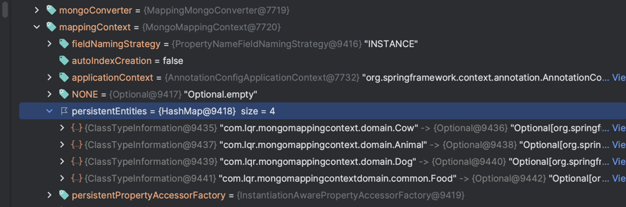

# Methods to create objects from Spring Data Mongo

## `@Builder`

- Using this, Lombok will generate the following:

    - An inner static class named FooBuilder, with the same type arguments as the static method (
      called
      the builder).
    - In the builder: One private non-static non-final field for each parameter of the target.
    - In the builder: A package private no-args empty constructor.
    - In the builder: A 'setter'-like method for each parameter of the target: It has the same type
      as that parameter and the same name. It returns the builder itself, so that the setter calls
      can be chained, as in the above example.
    - In the builder: A build() method which calls the method, passing in each field. It returns the
      same type that the target returns.
    - In the builder: A sensible toString() implementation.
    - In the class containing the target: A builder() method, which creates a new instance of the
      builder.

# Object mapping with `@TypeAlias`

-

From [Spring docs](https://docs.spring.io/spring-data/mongodb/reference/mongodb/converters-type-mapping.html):

```
Type aliases only work if the mapping context is aware of the actual type.
The required entity metadata is determined either on first save or has to be provided via the configurations initial entity set. 
By default, the configuration class scans the base package for potential candidates.
```

## Domain classes

- From externalized module

```java

@Document("food")
@Getter
@NoArgsConstructor
@TypeAlias("food")
@SuperBuilder(toBuilder = true)
public abstract class Food {

    @Id
    private String id;
    private String name;
    private Double nutritionalValue;
}


@Getter
@NoArgsConstructor
@SuperBuilder(toBuilder = true)
@TypeAlias("laksa")
public class Laksa extends Food {

    private List<String> spices;
}
```

## Scenario 1: `MongoTemplate` is able to map a document to an object after creation

- This is aligned with the Spring docs, which says "Required entity metadata is determined on either
  first save"

```java

Laksa laksa=Laksa.builder().name("laksa1").build(); // First save
        foodservice.saveFood(laksa);

        List<Food> food=foodservice.findAllFood();
```

- Deserialization from MongoDb to Java objects is okay, because we did a save first, where the
  persistent entities consist of `Laksa` concrete class
  

## Scenario 2: `MongoTemplate` is not able to map a document to an object from externalized module without creation

- We see that the persistent entities does not include any concrete classes from the externalized
  module
    - 
- Error messages:

```log
org.springframework.data.mapping.model.MappingInstantiationException: Failed to instantiate com.lqr.mongomappingcontextdomain.common.Food using constructor public com.lqr.mongomappingcontextdomain.common.Food() with arguments 
...
Caused by: org.springframework.beans.BeanInstantiationException: Failed to instantiate [com.lqr.mongomappingcontextdomain.common.Food]: Class is abstract
```

## Scenario 3: `MongoTemplate` is able to map a document to an object from its own module without creation



- There are no issues, because aligning to the Spring docs "by default the configuration class scans
  the base package for potential candidates", base package here includes all its own domain classes

## Possible solutions from externalized modules with `@TypeAlias`

- M1: Add `@EntityScan(basePackages = "com.lqr.mongomappingcontextdomain")`
- M2: Specify these concrete classes in `mongoMappingContext.setInitialEntitySet()` in MongoTemplate
- M3: Override `getMappingBasePackage()` in `AbstractMongoConfiguration`
